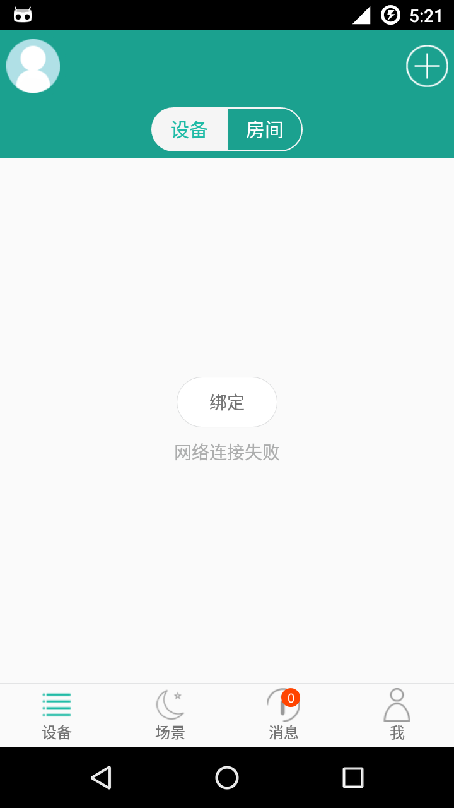
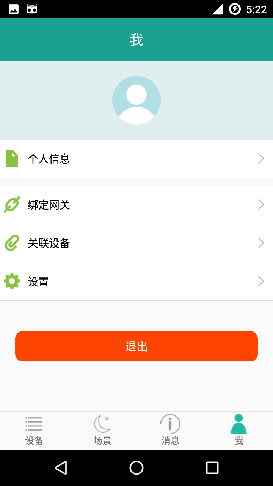
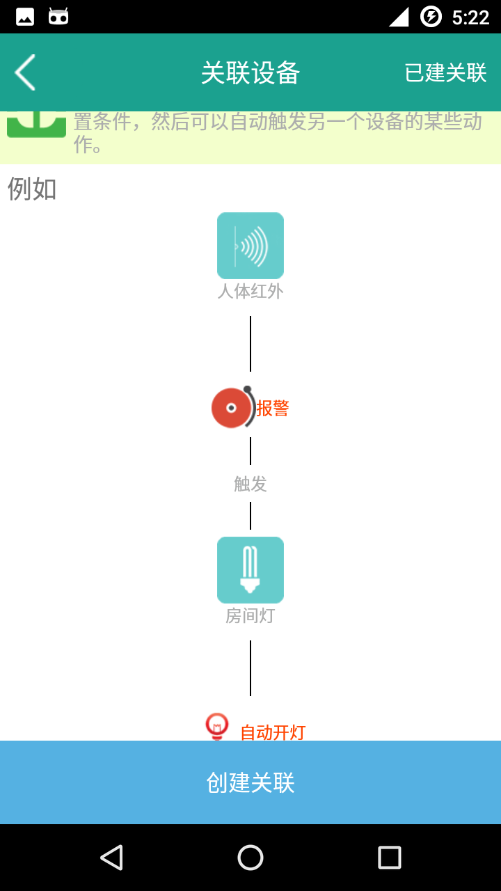
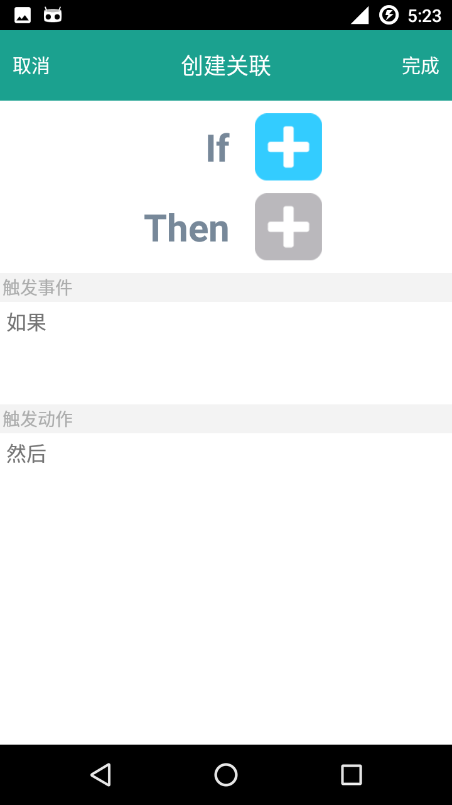

## About SmartDevice
A Android app demo for smart home devices 

## Compile & Install
It is a Android Studio project, you can compile and install in Android Studio directly

##Screenshot

<ul>
<li>

</li>

<li>

</li>

<li>

</li>

<li>

</li>

</ul>

